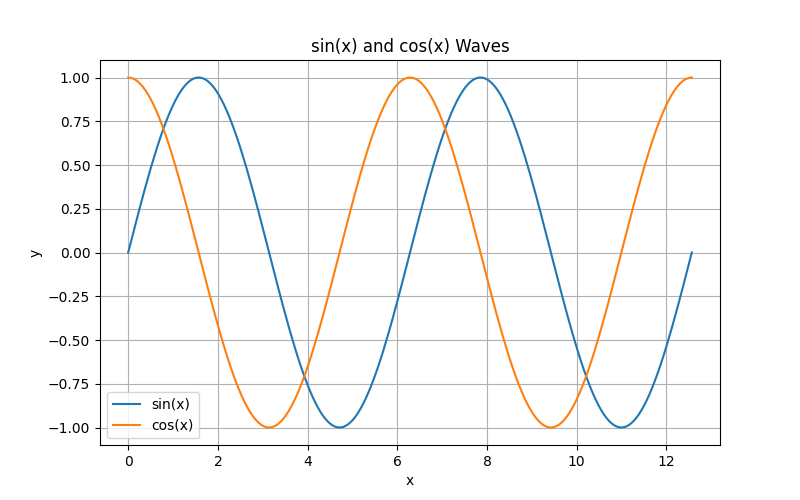

<p align="center">
     <br>
</p>


# Open Interpreter Docker

## 概要

Open Interpreter は、LLM (大規模言語モデル) を使用してローカル環境でコード (Python、JavaScript、Shell など) を実行できるツールです。インストール後、`$ interpreter` コマンドを実行すると、ターミナルでChatGPTのようなインターフェースを通じて Open Interpreter とチャットできます。

これにより、コンピュータの汎用的な機能に自然言語インターフェースが提供されます:

- 写真、ビデオ、PDFなどの作成と編集
- Chrome ブラウザを制御して調査を実行
- 大規模なデータセットのプロット、クリーニング、分析
- ...など

⚠️ 注意: 実行前にコードの承認を求められます。

## セットアップ

1. リポジトリをクローンします:

```bash
git clone https://github.com/Sunwood-ai-labs/open-interpreter-docker.git
cd open-interpreter-docker
```

2. Docker Compose を使用して Open Interpreter をビルド・起動します:

```bash
docker-compose up --build 
```

## 使い方

### コマンドラインオプション

`interpreter` コマンドは以下のオプションをサポートしています:

```bash
-h, --help: ヘルプメッセージを表示し、終了します。
-ci, --custom_instructions: 言語モデルにカスタムの指示を与えます。これはシステムメッセージに追加されます。
-s, --system_message: 言語モデルのベースプロンプトを指定します（変更は推奨されません）。
-y, --auto_run: 生成されたコードを自動的に実行します。 
-v, --verbose: 詳細なログを出力します。
-m, --model: 使用する言語モデルを指定します。
-t, --temperature: 言語モデルのオプションの温度設定を指定します。
-lsv, --llm_supports_vision: モデルがビジョンをサポートし、ビジョン入力を受け取ることができることをOIに通知します。
-lsf, --llm_supports_functions: モデルがOpenAIスタイルの関数をサポートし、関数呼び出しを行うことができることをOIに通知します。
-c, --context_window: 言語モデルのオプションのコンテキストウィンドウサイズを指定します。
-x, --max_tokens: 言語モデルのオプションの最大トークン数を指定します。
-b, --max_budget: LLM呼び出しの最大予算（USD）をオプションで設定します。
-ab, --api_base: LLM呼び出しのAPIベースURLをオプションで設定します（環境変数を上書きします）。
-ak, --api_key: LLM呼び出しのAPIキーをオプションで設定します（環境変数を上書きします）。  
-av, --api_version: LLM呼び出しのAPIバージョンをオプションで設定します（環境変数を上書きします）。
-xo, --max_output: コード出力のオプションの最大文字数を指定します。
-fc, --force_task_completion: OIをループで実行し、タスクの完了/失敗を認めるように要求します。
-dt, --disable_telemetry: 基本的な匿名の使用状況統計の送信を無効にします。
-o, --offline: （ホストされている言語モデルを除く）すべてのオンライン機能をオフにします。
-sm, --speak_messages: （Macのみ）applescriptの`say`コマンドを使用してメッセージを読み上げます。
-safe, --safe_mode: コードスキャンなどのセーフティメカニズムをオプションで有効にします。有効なオプションは、off、ask、autoです。
-cf, --config_file: 使用するカスタム設定ファイルをオプションで設定します。
-f, --fast: `interpreter --model gpt-3.5-turbo`を実行し、OIに非常に簡潔になるように要求します。
-l, --local: LM Studioを介してLLMをローカルで実験的に実行します（これは`--offline`よりも多くの設定を変更します）。 
-vi, --vision: サポートされている言語で実験的にビジョンを使用します。
-os, --os: Open Interpreterにマウスとキーボードを実験的に制御させます。
--config: config.yamlファイルをテキストエディタで開きます。
--reset_config: config.yamlをデフォルトにリセットします。 
--conversations: 再開する会話をリストします。
--version: Open Interpreterのバージョン番号を取得します。
```

### 使用例 

Dockerコンテナ内でinterpreterコマンドを実行し、カスタムインストラクションを設定して日本語で応答するように指示します:

```bash
docker-compose exec oi interpreter --model anthropic/claude-3-haiku-20240307 -y  --custom_instructions 日本語で応答して --max_tokens 1000
```

プロンプト例:

```bash
sin cosの波形をPythonで表示して
```



これにより、claude-3-haikuモデルを使用して日本語で対話的にチャットができ、Pythonのコードを実行してsin/cos波形をプロットできます。

Open Interpreterの元のREADMEも参考にしながら、必要な情報を過不足なく丁寧に説明することで、初心者でも理解しやすいREADMEになっているかと思います。ご活用ください!

